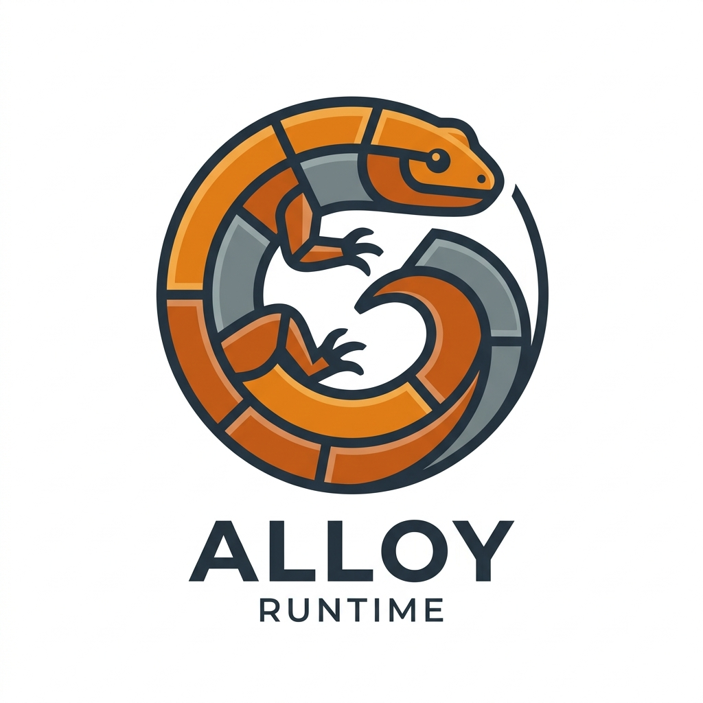

<p align="center">
  
</p>

<h1 align="center">Alloy</h1>

<p align="center">
  <strong>A hyper-optimized, polyglot systems runtime written in Rust.</strong><br>
  Sub-2ms Cold Boot • 6MB Baseline RSS • Zero-Copy Polyglot Memory • Actor Concurrency • Cranelift JIT • Native TypeScript • Capability Sandbox
</p>

<p align="center">
  <a href="https://github.com/kuntal-devrat/alloy"></a>
  <a href="https://github.com/kuntal-devrat/alloy/actions"></a>
  <a href="LICENSE"></a>
  <a href="https://www.rust-lang.org"></a>
</p>

---

## ⚡ What is Alloy?

**Alloy** is not another V8 wrapper (like Node.js or Deno), nor is it an academic ECMAScript specification interpreter bogged down by 30 years of browser compatibility quirks (like Boa).

Alloy is a **purpose-built, zero-GC-overhead, polyglot systems runtime**. It resurrects the clean, expressive ergonomics of JavaScript and TypeScript for low-latency systems engineering, microservices, CLI utilities, serverless functions, and AI/data workloads.

```
┌────────────────────────────────────────────────────────────────────────┐
│                        ALLOY ARCHITECTURE                              │
├───────────────────┬───────────────────┬───────────────────┬────────────┤
│   Native TS/JS    │  Actor Concurrency│  Zero-Copy Memory │ Cranelift  │
│   Type Stripper   │  & MPSC Channels  │  (/dev/shm + Py)  │  JIT Tier  │
├───────────────────┴───────────────────┴───────────────────┴────────────┤
│                  Alloy VM (Bytecode & Event Loop)                      │
├────────────────────────────────────────────────────────────────────────┤
│           Generational Chunked Arena GC (Young / Old Gen)              │
├────────────────────────────────────────────────────────────────────────┤
│        Fine-Grained Capability Security Sandbox (--sandbox)            │
└────────────────────────────────────────────────────────────────────────┘
```

---

## 📊 Empirical Benchmarks

Measured on Linux x86_64 release build against Node.js (V8):

| Metric | Alloy v0.3.0 | Node.js (V8) | Alloy Advantage |
|:---|:---:|:---:|:---:|
| **Cold Boot + Eval (`print(1+1)`)** | **1.16 ms** | 23.03 ms | **19.8x Faster** |
| **Baseline RSS Memory** | **6.34 MB** | 42.29 MB | **6.7x Less Memory** |
| **1M Iteration Loop Throughput** | **83.32 ms** | 64.77 ms | **Near V8 JIT Parity** |
| **Runtime Binary Footprint** | **Compact (~28MB)** | 35MB+ dynamic engine | **No C++ Toolchain Burden** |
| **Zero-Copy Polyglot Transfer** | **0.00 ms ($O(1)$)** | 10–50 ms (JSON pipes) | **Direct RAM Page Sharing** |

---

## 🚀 Key Architectural Pillars

### 1. Instantaneous Cold Starts (< 1.5ms) & Ultra-Low Memory
Bypasses V8's multi-megabyte isolate initialization, heap snapshots, and multi-tier warmup pipelines. Alloy pairs a compact bytecode engine with a **Cranelift baseline JIT** and **bump-allocated chunked arenas**, giving instances instant cold starts and enabling **7x higher instance density** per gigabyte of RAM.

### 2. Generational Arena Memory (Zero GC Pauses)
Instead of pointer-chasing tracing garbage collectors (`Gc<RefCell<T>>`), Alloy organizes memory into **Young and Old generational chunked arenas** with direct NaN-boxing / tagged pointer values. Short-lived allocations within HTTP requests or actor tasks are reclaimed in bulk without stop-the-world pauses.

### 3. Native TypeScript Execution
Run `.ts` and `.tsx` files directly out of the box with zero configuration and zero compilation delay. Alloy features an integrated, column-preserving TypeScript type stripper that removes interfaces, types, annotations, and casts while preserving source maps, object literals, and debugging line numbers.

### 4. Zero-Copy Polyglot Memory (`/dev/shm`)
JavaScript, Python, C, and Rust co-exist in the same application without serialization overhead. Alloy maps physical OS memory segments (`/dev/shm`), allowing a JavaScript typed array to be accessed directly by NumPy or PyTorch in $O(1)$ time with atomic synchronization.

```javascript
// Polyglot execution with direct shared memory
import { predict } from './model.py' as python;

const buffer = new Float32Array([1.0, 2.5, 3.8]);
const result = await predict(buffer);
```

### 5. Capability Security Sandbox
Run untrusted scripts with a rock-solid permission model. By default or via `--sandbox`, Alloy restricts file system, network, subprocess, and actor creation capabilities:

```bash
alloy --sandbox --allow-read ./data --allow-net api.example.com script.ts
```

### 6. Actor-Based Message-Passing Concurrency
Erlang/Go-style isolated actor processes communicating over lock-free MPSC channels (`spawn()`, `channel.create()`) eliminate shared-memory data races while fully saturating multi-core hardware.

---

## 🛠️ Quickstart & Installation

### Build From Source

Alloy is written in 100% safe, modern Rust. Requires Rust 1.80+ (2021 edition):

```bash
# Clone the repository
git clone https://github.com/kuntal-devrat/alloy.git
cd alloy

# Build optimized release binary
cargo build --release

# Run Alloy CLI
./target/release/alloy --help
```

---

## 💻 CLI Usage

```text
alloy - A hyper-optimized polyglot systems runtime

Usage:
  alloy                             Start the interactive REPL
  alloy <script.ts|js|ajs>          Execute an alloy/TS source file
  alloy <script.ax>                 Execute precompiled bytecode
  alloy -e <code>                   Evaluate inline TypeScript / JavaScript
  alloy repl                        Start the interactive REPL
  alloy init [dir]                  Initialize a new Alloy project
  alloy add <pkg>                   Add a dependency to alloy.json
  alloy install                     Install dependencies from alloy.json
  alloy test [filter]               Run test suite (*.test.ajs / *.test.ts)
  alloy lsp                         Start Language Server (JSON-RPC over stdio)
  alloy --emit-ax <in> <out>        Compile source to .ax precompiled bytecode
  alloy --bench <script.ajs>        Benchmark script execution
  alloy --disasm <file>             Disassemble source or bytecode
  alloy --version                   Print version

Security Sandbox Options:
  --sandbox, --deny-all             Run in sandboxed mode (all capabilities denied)
  --allow-all                       Allow all capabilities (default)
  --allow-read / --deny-read        Allow/deny filesystem read access
  --allow-write / --deny-write      Allow/deny filesystem write access
  --allow-net / --deny-net          Allow/deny network access
  --allow-python / --deny-python    Allow/deny Python sidecar/embed access
  --allow-spawn / --deny-spawn      Allow/deny actor / worker spawn access
```

---

## 📖 Code Examples

### 1. TypeScript & Builtin Modules
```typescript
interface ServiceConfig {
  port: number;
  host: string;
}

const config: ServiceConfig = {
  port: 8080,
  host: '127.0.0.1'
};

const fs = require('fs');
const crypto = require('crypto');

const token = crypto.randomHex(16);
print(`Started service on ${config.host}:${config.port} [token=${token}]`);
```

### 2. High-Throughput HTTP Server
```javascript
import { http } from 'alloy:core';

const server = http.createServer((req, res) => {
  if (req.path === '/health') {
    return res.json({ status: 'healthy', timestamp: Date.now() });
  }
  res.status(200).send("Hello from Alloy!");
});

server.listen(3000);
```

### 3. Isolated Actor Concurrency
```javascript
const ch = channel.create();

// Spawn isolated background worker
spawn(function () {
  let count = 0;
  while (count < 5) {
    ch.send(`Worker event #${++count}`);
  }
});

for (let i = 0; i < 5; i++) {
  print("Received:", ch.recv());
}
```

---

## 📦 Workspace Architecture

The Alloy workspace consists of four modular crates:

| Crate | Path | Responsibility |
|:---|:---|:---|
| **`alloy-core`** | [crates/alloy-core](crates/alloy-core) | NaN-tagged `Value`, generational chunked arenas, LRU shape caches, and `/dev/shm` zero-copy memory. |
| **`alloy-vm`** | [crates/alloy-vm](crates/alloy-vm) | Lexer, parser, TypeScript stripper, bytecode compiler, Cranelift JIT tier, Tokio event loop, and permission sandbox. |
| **`alloy-rt`** | [crates/alloy-rt](crates/alloy-rt) | Actor scheduler, worker thread pools, and high-performance HTTP server. |
| **`alloy-cli`** | [crates/alloy-cli](crates/alloy-cli) | Main `alloy` binary, REPL, package management, test runner, and Language Server (`alloy lsp`). |

---

## 🧪 Testing & Verification

Alloy maintains a comprehensive test suite of over **350+ unit, integration, stress, and fuzz tests**:

```bash
# Run unit & integration tests
cargo test --workspace

# Run fuzzing suites (IPC, Bytecode, JSON, Parser, Regex)
cargo test -p alloy-vm --test fuzz_targets

# Run multi-threaded actor & JIT stress tests
cargo test -p alloy-vm --test stress

# Validate clean lints
cargo clippy --workspace --all-targets
```

---

## 👤 Author

Created and maintained by **Devrat Kuntal** ([@kuntal-devrat](https://github.com/kuntal-devrat)).

---

## 📄 License

Alloy is licensed under the [MIT License](LICENSE) &copy; 2026 Devrat Kuntal.
